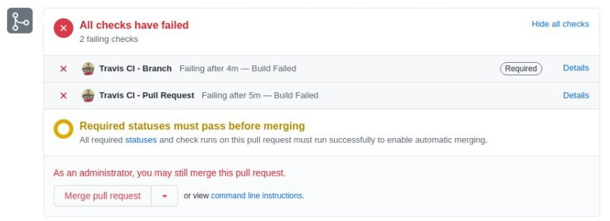

# Trabalho Individual - GCES - 2020/1

A Gestão de Configuração de Software é parte fundamental no curso de GCES, e dominar os conhecimentos de configuração de ambiente, containerização, virtualização, integração e deploy contínuo tem se tornado cada vez mais necessário para ingressar no mercado de trabalho.

Para exercitar estes conhecimentos, você deverá aplicar os conceitos estudados ao longo da disciplina no produto de software contido neste repositório.

O sistema se trata de uma aplicação Web, cuja funcionalidade consiste na pesquisa e exibição de perfis de usuários do GitHub, que é composta de:

- Front End escrito em Javascript, utilizando os frameworks Vue.JS e Quasar;
- Back End escrito em Ruby on Rails, utilizado em modo API;
- Banco de Dados PostgreSQL;

Para executar a aplicação na sua máquina, basta seguir o passo-a-passo descrito no arquivo [Descrição e Instruções](Descricao-e-Instrucoes.md).

## Critérios de avaliação

### 1. Containerização

A aplicação deverá ter seu ambiente completamente containerizado. Desta forma, cada subsistema (Front End, Back End e Banco de Dados) deverá ser isolado em um container individual.

Deverá ser utilizado um orquestrador para gerenciar comunicação entre os containers, o uso de credenciais, networks, volumes, entre outras configurações necessárias para a correta execução da aplicação.

Para realizar esta parte do trabalho, recomenda-se a utilização das ferramentas:

- Docker versão 17.04.0+
- Docker Compose com sintaxe na versão 3.2+

### 2. Integração contínua

Você deverá criar um 'Fork' deste repositório, onde será desenvolvida sua solução. Nele, cada commit submetido deverá passar por um sistema de integração contínua, realizando os seguintes estágios:

- Build: Construção completa do ambiente;
- Testes: Os testes automatizados da aplicação devem ser executados;
- Coleta de métricas: Deverá ser realizada a integração com algum serviço externo de coleta de métricas de qualidade;

O sistema de integração contínua deve exibir as informações de cada pipeline, e impedir que trechos de código que não passem corretamente por todo o processo sejam adicionados à 'branch default' do repositório.

Para esta parte do trabalho, poderá ser utilizada qualquer tecnologia ou ferramenta que o aluno desejar, como GitlabCI, TravisCI, CircleCI, Jenkins, CodeClimate, entre outras.

### 3. Deploy contínuo (Extra)

Caso cumpra todos os requisitos descritos acima, será atribuída uma pontuação extra para o aluno que configure sua pipeline de modo a publicar a aplicação automaticamente, sempre que um novo trecho de código seja integrado à branch default.


# Solução Desenvolvida

* **Aluno: Alexandre Miguel Rodrigues Nunes Pereira**
* **Matrícula: 16/0000840**


## **1. Containerização**

### Ferramentas

- **[Docker](https://docs.docker.com/engine/install/ubuntu/)**: 20.10.0
- **[Docker-compose](https://docs.docker.com/compose/install/)**: 1.27.4

### Descrição

Para executar a aplicação, clone o repositório em um diretório vazio na sua máquina e instale as dependências supracitadas. Após isso, basta executar o comando:

```
sudo docker-compose up --build
```

É possível que ocorra um erro de conexão ao rodar o comando por conta de dependências externas adicionadas para o completo funcionamento. Nesse caso, basta rodar o comando novamente. Caso o problema persista, recomenda-se utilizar outra rede de conexão.

Os comandos de criação de banco de dados na api são rodados automaticamente, possibilitado por conta da biblioteca externa que aguarda até que a porta ```5432``` do container do ```postgres``` esteja rodando.

Após os containers terem subido corretamente, caso não haja outro projeto de mesmo nome sendo executado, cada um deles ficará disponível sob a seguinte nomenclatura:

- **CLIENT**: trabalho-individual-2020-1_client_container_1 
- **API**: trabalho-individual-2020-1_api_container_1
- **POSTGRES**: trabalho-individual-2020-1_db_postgres_1

## **2. Integração contínua**

Para a construção do pipeline de integração contínua, foi utilizado o [Travis CI](https://travis-ci.com/github/aleronupe/Trabalho-Individual-2020-1), executando cada teste dentro do container do Docker e analisando se todos os testes passam, obtendo a seguinte *badge* na branch ```master``` do repositório:

[](https://travis-ci.com/aleronupe/Trabalho-Individual-2020-1)

Para isso, foi elaborado um arquivo ```.travis.yml``` na pasta root do projeto para definir os processos de execução dos containeres e de seus respectivos testes, utilizando, para o frontend, o comando:

```
docker exec -it trabalho-individual-2020-1_api_container_1 bundle exec rails test
```

E, para o backend, o comando: 

```
docker exec -it trabalho-individual-2020-1_api_container_1 bundle exec rails test
```

Assim, conforme o fluxo de execução dos testes, é necessário somente estruturar a referência para os diretórios em que eles foram executados dentro de cada container, permitindo a obtenção de métricas. Ao final do projeto, a execução do pipeline do [**Travis CI**](https://travis-ci.com/github/aleronupe/Trabalho-Individual-2020-1) estava da seguinte forma:


Conforme a configuração do repositório, quando o CI do Travis não passa corretamente, os PRs são bloqueados - exceto para adminstradores - garantindo assim uma proteção da branch default ```master```



### Link para o Travis CI do Projeto: [https://travis-ci.com/github/aleronupe/Trabalho-Individual-2020-1](https://travis-ci.com/github/aleronupe/Trabalho-Individual-2020-1)

## **3. Obtenção de Métricas**

Conforme descrito na etapa anterior, as métricas de testes foram obtidas conforme a execução desses testes dentro do container, utilizando o [**Code Climate**](https://codeclimate.com/github/aleronupe/Trabalho-Individual-2020-1) para obtenção e exibição dessas métricas. Para isso, foi utilizada a integração dessa ferramenta com o **Travis CI**](https://travis-ci.com/github/aleronupe/Trabalho-Individual-2020-1) através da alteração de comandos no arquivo ```.travis.yml```. Ao final do projeto, a cobertura de métricas exibidas estava da seguinte forma:


### Link para o Code Climate do Projeto: [https://codeclimate.com/github/aleronupe/Trabalho-Individual-2020-1](https://codeclimate.com/github/aleronupe/Trabalho-Individual-2020-1)