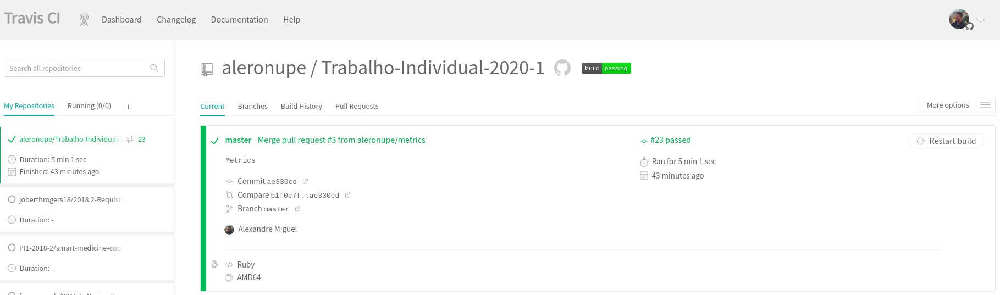

# Solução Desenvolvida

* **Aluno: Alexandre Miguel Rodrigues Nunes Pereira**
* **Matrícula: 16/0000840**


## **1. Containerização**

### Ferramentas

- **[Docker](https://docs.docker.com/engine/install/ubuntu/)**: 20.10.0
- **[Docker-compose](https://docs.docker.com/compose/install/)**: 1.27.4

### Descrição

Para executar a aplicação, clone o repositório em um diretório vazio na sua máquina e instale as dependências supracitadas. Após isso, basta executar o comando:

```
sudo docker-compose up --build
```

É possível que ocorra um erro de conexão ao rodar o comando por conta de dependências externas adicionadas para o completo funcionamento. Nesse caso, basta rodar o comando novamente. Caso o problema persista, recomenda-se utilizar outra rede de conexão.

Os comandos de criação de banco de dados na api são rodados automaticamente, possibilitado por conta da biblioteca externa que aguarda até que a porta ```5432``` do container do ```postgres``` esteja rodando.

Após os containers terem subido corretamente, caso não haja outro projeto de mesmo nome sendo executado, cada um deles ficará disponível sob a seguinte nomenclatura:

- **CLIENT**: trabalho-individual-2020-1_client_container_1 
- **API**: trabalho-individual-2020-1_api_container_1
- **POSTGRES**: trabalho-individual-2020-1_db_postgres_1

## **2. Integração contínua**

Para a construção do pipeline de integração contínua, foi utilizado o [Travis CI](https://travis-ci.com/github/aleronupe/Trabalho-Individual-2020-1), executando cada teste dentro do container do Docker e analisando se todos os testes passam, obtendo a seguinte *badge* na branch ```master``` do repositório:

[](https://travis-ci.com/aleronupe/Trabalho-Individual-2020-1)

Para isso, foi elaborado um arquivo ```.travis.yml``` na pasta root do projeto para definir os processos de execução dos containeres e de seus respectivos testes, utilizando, para o frontend, o comando:

```
docker exec -it trabalho-individual-2020-1_api_container_1 bundle exec rails test
```

E, para o backend, o comando: 

```
docker exec -it trabalho-individual-2020-1_api_container_1 bundle exec rails test
```

Assim, conforme o fluxo de execução dos testes, é necessário somente estruturar a referência para os diretórios em que eles foram executados dentro de cada container, permitindo a obtenção de métricas. Ao final do projeto, a execução do pipeline do [**Travis CI**](https://travis-ci.com/github/aleronupe/Trabalho-Individual-2020-1) estava da seguinte forma:



Conforme a configuração do repositório, quando o CI do Travis não passa corretamente, os PRs são bloqueados - exceto para adminstradores - garantindo assim uma proteção da branch default ```master```


## **3. Obtenção de Métricas**

Conforme descrito na etapa anterior, as métricas de testes foram obtidas conforme a execução desses testes dentro do container, utilizando o [**Code Climate**](https://codeclimate.com/github/aleronupe/Trabalho-Individual-2020-1) para obtenção e exibição dessas métricas. Para isso, foi utilizada a integração dessa ferramenta com o **Travis CI**](https://travis-ci.com/github/aleronupe/Trabalho-Individual-2020-1) através da alteração de comandos no arquivo ```.travis.yml```. Ao final do projeto, a cobertura de métricas exibidas estava da seguinte forma:


